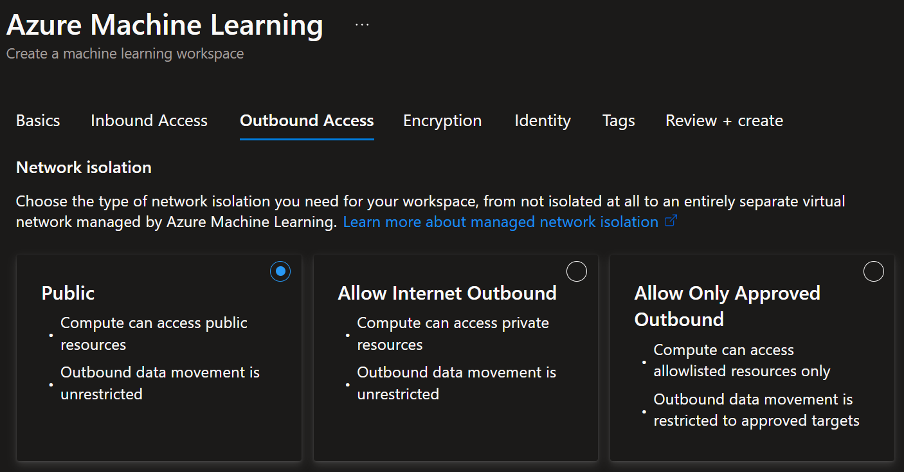

# Creating an Azure Machine Learning Workspace

This guide provides step-by-step instructions for creating an Azure Machine Learning workspace in the Azure portal. The workspace serves as the home within which we manage the lifecycle of the diabetes prediction machine learning project.

## Prerequisites

- An active Azure subscription
- Sufficient permissions to create resources in your subscription

## Why Create an AML Workspace?

The Azure Machine Learning workspace is the foundational resource that provides:
- A centralized place to work with all the machine learning artifacts.
- Integration with other Azure services like storage for data and compute for model training and inference.
- Version tracking for assets like data assets, environments, and models.
- Comprehensive job and pipeline tracking with metrics, logs, and visualizations for monitoring experiments.
- Monitoring of the machine learning lifecycle.
- Collaboration between team members.

## Steps to Create an Azure Machine Learning Workspace

### 1. Create a New Resource in the Azure Portal

Navigate to the [Azure Portal](https://portal.azure.com/) and sign in with your Azure account. Then search for then select the Azure Machine Learning service. Click `Create`. Start filling out the mandatory configuration, including resource group and workspace name.

### 2. Inbound Network Configuration

For simplicity of demonstration, we select `All networks`. Highly recommended to configure production workspace deployments with public access disabled.

### 3. Outbound Network Configuration

Again, for demo only, we enable `Public`.

### 4. Review and Create

After clicking through the remaining tabs, click the `Create` button to start the process of creating the new Machine Learning workspace. Deployment will take a few minutes to complete. Once deployment is successful, you'll see a notification, and you can click `Go to resource` to access the new Azure Machine Learning workspace.

