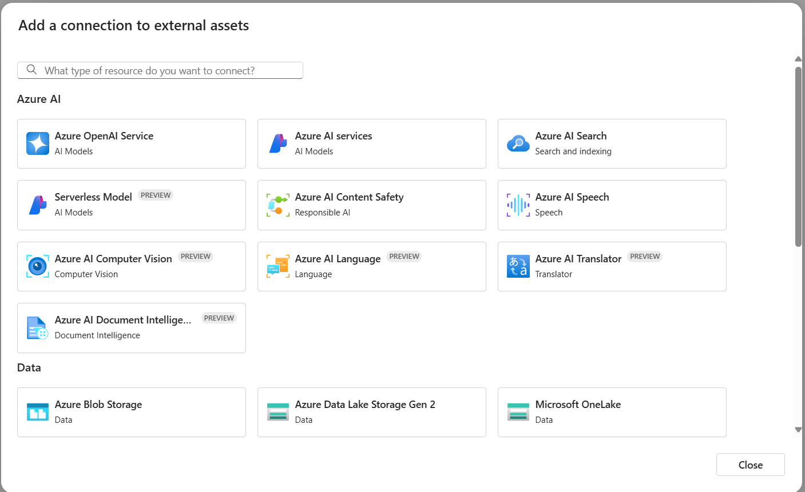

In the Azure Machine Learning workspace, connections can be configured to be shared across the entire workspace or limited to the creator. Secrets associated with connections are securely persisted in the corresponding Azure Key Vault, adhering to robust security and compliance standards.

Connections can include Microsoft OneLake, Azure OpenAI, Azure AI Search, and Azure Content Safety, primarily for consumption by promptflow.

**Note** the above screenshot shows an option to create a Microsoft OneLake connection, which is part of Microsoft Fabric. Currently, AML supports connection to Microsoft Fabric lakehouse artifacts in *Files* folder that include folders or files and Amazon S3 shortcuts. See [here](https://learn.microsoft.com/en-us/azure/machine-learning/how-to-datastore?view=azureml-api-2&tabs=sdk-identity-based-access%2Csdk-adls-identity-access%2Csdk-azfiles-accountkey%2Csdk-adlsgen1-identity-access%2Csdk-onelake-identity-access#create-a-onelake-datastore) for more detail.

## Resources
[What is prompt flow?](thttps://learn.microsoft.com/en-us/azure/machine-learning/prompt-flow/overview-what-is-prompt-flow?view=azureml-api-2)

