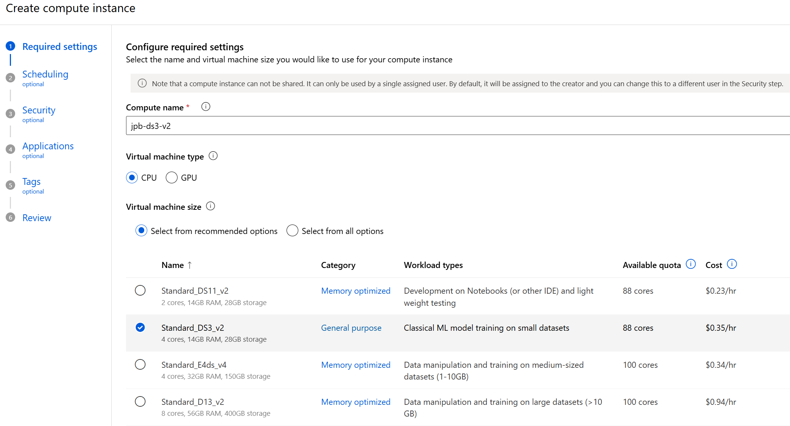

# Setting Up Compute Resources for Azure Machine Learning

This guide walks you through setting up the necessary compute resources for training your diabetes prediction model in Azure Machine Learning.

## Prerequisites

- An Azure Machine Learning workspace (created in an [earlier step](../01-create-aml-workspace/README.md))
- Appropriate permissions to create and manage resources

## Creating a User-Assigned Managed Identity

### Why Use a Managed Identity?

A managed identity allows your compute resources to securely access other Azure services (like storage accounts and key vaults) without storing and managing credentials like keys. 

Why is this needed here? For our diabetes prediction project, the managed identity will enable the compute cluster to access training data and other resources in the AML workspace.

### Steps to Create a Managed Identity

1. In the Azure portal, search for `Managed Identities` in the search bar
2. Select "Create"
3. Fill in the required details:
   - Subscription: Select your Azure subscription
   - Resource group: You can use the same resource group as your AML workspace
   - Region: Use the same region as your AML workspace
   - Name: Give your managed identity a descriptive name


## Assigning Roles to the Managed Identity

After creating the managed identity, you need to enable it to work with the machine learning workspace by giving it appropriate roles:

1. Navigate to your Azure Machine Learning workspace in the Azure portal
2. Select `Access control (IAM)` from the left menu
3. Click `Add role assignment`
4. Assign the following roles to your managed identity:
   - **AzureML Compute Operator**: Allows the identity to manage workspace compute resources
   - **AzureML Data Scientist**: Provides permissions to perform workspace machine learning operations


## Creating a Compute Cluster

Now we are ready to create a compute cluster, which is automatically scalable compute to train our diabetes model.

1. Navigate to [Azure Machine Learning studio](https://ml.azure.com)
2. Sign in with the same account used to create the AML workspace
3. Select your workspace
4. In the left navigation, select `Compute`
5. Select the `Compute clusters` tab and click `New`


6. Configure your compute cluster:
   - Compute name: Give your cluster a unique name (e.g., `cpu-cluster-01`)
   - Virtual machine type: Select `CPU` for this project
   - Virtual machine size: Choose based on your needs (e.g., `Standard_DS3_v2`)
   - Minimum/maximum nodes: Set minimum to 0 to avoid charges when not in use
   - Idle seconds before scale down: Set according to your needs


   - Advanced settings: Select your user-assigned managed identity you created earlier


## Creating a Compute Instance

A compute instance is a fully managed cloud-based workstation for data scientists. It provides an integrated terminal and notebook experience for development and experimentation.

1. Again, in the Azure Machine Learning studio, go to the `Compute` section
2. Select the `Compute instances` tab and click `New`
3. Configure your compute instance:
   - Compute name: Give your instance a unique name
   - Virtual machine type: Select CPU
   - Virtual machine size: Choose based on your needs (e.g., `Standard_DS3_v2`)



It is highly recommended to set the scheduling and auto shutdown policies for your Azure Machine Learning compute instances. This helps optimize costs by ensuring compute resources are only active when needed and prevents accidental resource consumption during idle periods.


## Accessing Your Compute Instance

Once your compute instance is running, you have 2 options to use it:

### Option 1: Browser-Based Development

Access directly through applications served directly by the compute instance your browser, for quick development without any local setup:

1. **Jupyter Notebooks**: Traditional notebook interface for data exploration and model development
2. **JupyterLab**: Enhanced notebook experience with file browser and multiple tabs
3. **Terminal**: Browser-based command line for package management and script execution

### Option 2: Local VS Code Connection

Connect your local VS Code install to the remote compute instance for a full-featured IDE experience. From the list of available compute instance applications, select `VS Code (Desktop)`.


## Setting Up Your Development Environment

Regardless of which access method you choose:

1. In the terminal, check available Conda environments:
   ```bash
   conda env list
   ```

2. Activate the Azure ML SDK v2 environment:
   ```bash
   conda activate azureml_py310_sdkv2
   ```

This environment has all the necessary packages for working with Azure Machine Learning and this diabetes prediction use case.

## Next Steps

Now that your compute resources are set up, you can proceed to [set up your dataset](../03-create-the-dataset/README.md) for the diabetes prediction project.