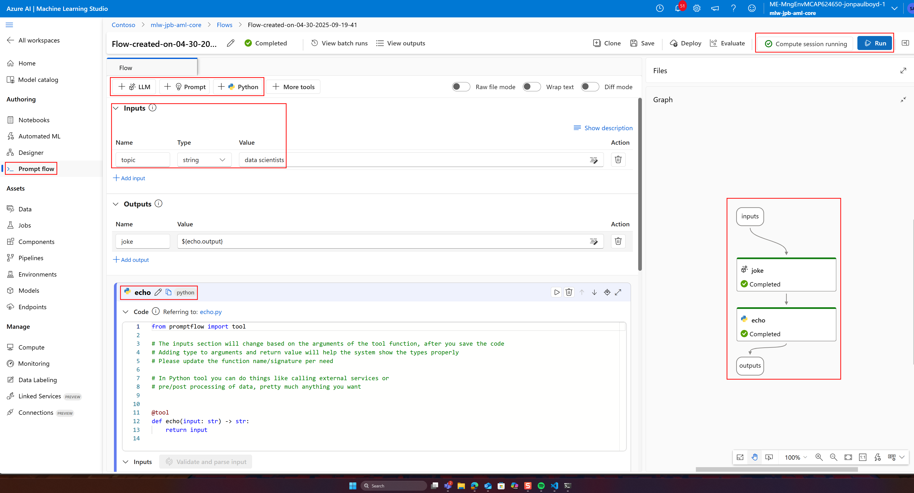
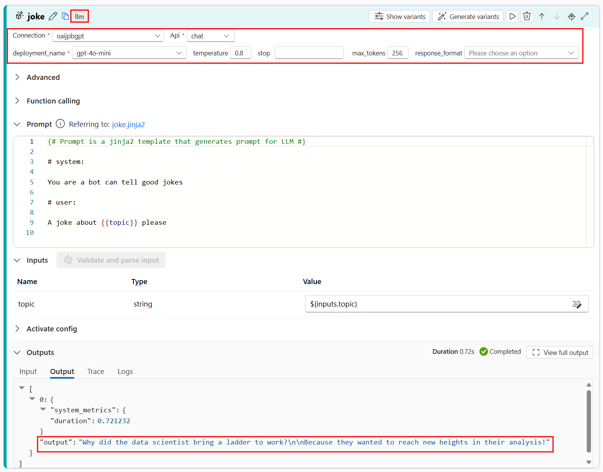

# Azure Promptflow

Azure Promptflow is a comprehensive development tool that streamlines the lifecycle of applications powered by LLMs, from prototyping and experimentation to deployment and monitoring. It is an orchestrator that executes LLM and python nodes and returns the final output.

## Key Features

* **Visual Flow Creation** - Build executable flows that connect LLMs, prompts, and Python tools through an intuitive visualized graph interface.
* **Collaborative Development** - You can version controkl and share promptflows.
* **Prompt Engineering & Evaluation** - Create prompt variants and evaluate their performance.
* **Enterprise-Ready Deployment** - Deploy promptflows as real-time endpoints for consumption.

## Connections

Connections in Promptflow securely manage credentials and secrets for APIs and data sources:

* Include prebuilt connections, including for Azure OpenAI and AI Search
* Encapsulate essential information like endpoints and authentication details
* Securely store secrets in Azure Key Vault

## Flow Types

Azure Promptflow offers three specialized flow types:

* **Standard Flow** - For general application development
* **Chat Flow** - Tailored for conversational applications with enhanced support for chat history management
* **Evaluation Flow** - Designed to evaluate the performance of previous flow runs and output relevant metrics

## Tools

Tools are the fundamental building blocks of a flow:

* **LLM Tool** - Write custom prompts and leverage LLMs
* **Python Tool** - Create custom Python functions for custom data processing, evaluation, and API calls for example
* **Prompt Tool** - Prepare prompts as strings

## Example standard promptflow

The screenshots below shows a standard flow with the main components:

- An input node with a parameter *topic* with the value *data scientists*.
- An LLM node called *joke* that defines the LLM service connection details and parameters like temperature. Additionally, a prompt to instruct the LLM to tell a joke about the input topic.
- A Python node named *echo* that demonstrates taking output from the LLM and echoing it back. You could post-parse LLM output here, for example.
- An output node that receives the Python node output

The screenshot also includes a visual graph representation of the promptflow, illustrating the connections between the nodes.

