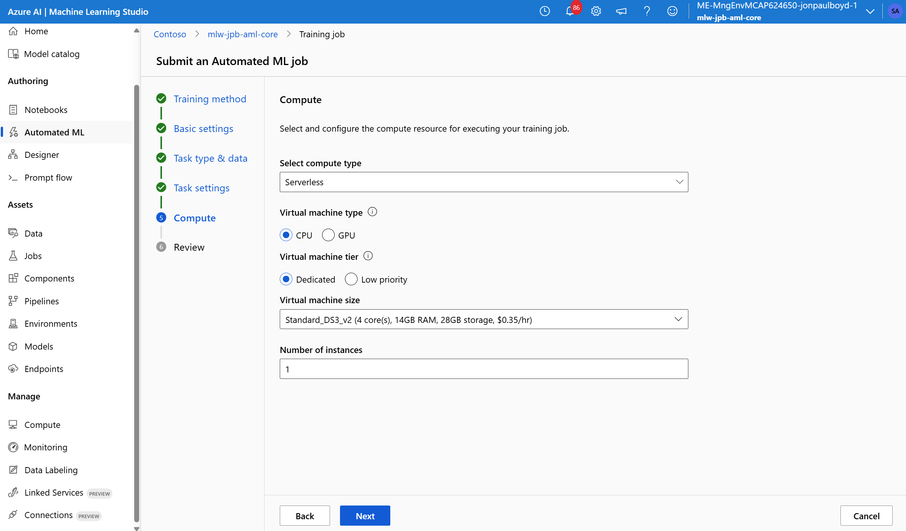

# Automated Machine Learning for Diabetes Classification

Here's a step-by-step walkthrough of creating an automated machine learning job for a diabetes classification task using Azure Machine Learning.

## What is Automated Machine Learning?

Automated Machine Learning (AutoML) automates the time and skills intensive process of selecting and training models for a given machine learning task. It iterates over many combinations of algorithms and hyperparameters to help find the best model based on a chosen metric, such as AUC (Area Under Curve).

## Creating an Automated Machine Learning Job

Complete the following experiment set-up and run steps using the Azure Machine Learning studio:

1. In the navigation pane, select **Authoring** > **Automated ML**.
2. Select **New Automated ML job**.

3. Provide an experiment name, a description for the diabetes classification experiment, and any tags.

4. Set task type as **Classification**
5. Then click *Create* to upload the diabetes data file to our AML workspace as an Azure Machine Learning data asset.

6. In the **Type** field, select **Tabular**. Also provide a name and description for the datatset.

7. In the **Data source** form, select **From local files**.

8. In **Destination storage type**, select the default datastore *workspaceblobstore*.

9. In **File or folder selection**, select **Upload files or folder** > **Upload files**.
   - Choose the `diabetes.csv` file from your local computer.

10. When the upload finishes, you can view the dataset settings. Ensure the file format is set to **Delimited** with a comma as the delimiter. You can preview the data.

11. In the **Schema** form, you can include or exclude specific columns. For this diabetes use case, I included all columns.

12. In the **Review** form, verify then select **Create**.

13. Select the newly created dataset, then select **Next**.

14. Select the column **Diabetic** as our target column, which is the one we want to predict (whether a patient has diabetes or not).
   - Select **View additional configuration settings** and populate the fields as follows:
     - **Primary metric**: AUC_weighted
     - **Explain best model**: Enable
     - **Blocked models**: None (or exclude specific algorithms if desired)
   - Select **Save**.

**Note**: Clicking **view additional configuration settings** allows you to customise the set of algorithms iterated over. You can:
   - Leave checkbox *use all supported models* enabled then customise a list of blocked, deselected models, or
   - Uncheck *use all supported models* and specifically select a subset of algorithms to test, for example LogisticRegression and RandomForest

**Note**: In the task settings step, clicking **view featurization settings** allows you to set the feature imputation strategy for each input feature column, see below. There doesn't appear to be a way to apply a pure custom imputation strategy with AutoML. If you need a completely custom imputation approach, you might need to pre-process your data asset with custom imputation logic before feeding it to AutoML.

15. Configure **validation and test data**. In our test diabetes dataset, we only have 15000 rows, so AutoML defaults to cross-validation with 3 folds. For more inmformation on validation configuration options, including brining your own test dataset, see [here](https://learn.microsoft.com/en-us/azure/machine-learning/how-to-use-automated-ml-for-ml-models?view=azureml-api-2#validate-and-test).

16. Select compute type. Here I selected **Serverless** with a small VM SKU size for demo. Other compute type options include *compute cluster* and *compute instance*. The remaining configuration is shown in the screenshot below:

17. Select **Submit training job** to run the experiment.

18. The **Job Overview** screen opens with the **Status** at the top left, showing the current status as the experiment progresses. 

**Note**: Preparation takes 10-15 minutes to prepare the experiment run. Once running, it takes 2-3 minutes more for each iteration.

19. AutoML provides safeguards for model training by automatically handling data splits, cross-validation, imbalanced data detection, and feature processing, including imputation strategies for missing values,and removal of high-cardinality features, that could create bias and affect model performance.

20. While the AutoML experiment is running, you can start exploring the tested algorithms as they complete:

- Navigate to the **Models + child jobs** tab to see the algorithms (models) tested.
- By default, the job orders the models by metric score as they complete. For this diabetes experiment, the highest scoring model by chosen metric (AUC_weighted) is at the top of the list.

21. Via the model summary, we can also see the hyperparameter settings of the scored model.

22. Evaluate the model's performance by reviewing key metrics like AUC in the **Metrics** tab.

23. The **Metrics** tab also provides visual diagnostic tools such as confusion matrices that provide insights into classification performance across the different classes.

24. Azure Machine Learning's Responsible AI dashboard for our diabetic prediction model provides oversight tools, for a view of performance metrics, fairness assessments, and error analysis.

This helps understand, for example, what features significantly influence diabetes predictions, and answer questions like *"What kinds of errors does my model have?"* and *"In what areas are errors most prevalent?"*, for example age demographics.

**Note** the automated machine learning feature allows you to deploy the best model as a web service endpoint for prediction inference.

## Resources
[Set up no-code Automated ML training for tabular data with the studio UI](https://learn.microsoft.com/en-us/azure/machine-learning/how-to-use-automated-ml-for-ml-models?view=azureml-api-2)