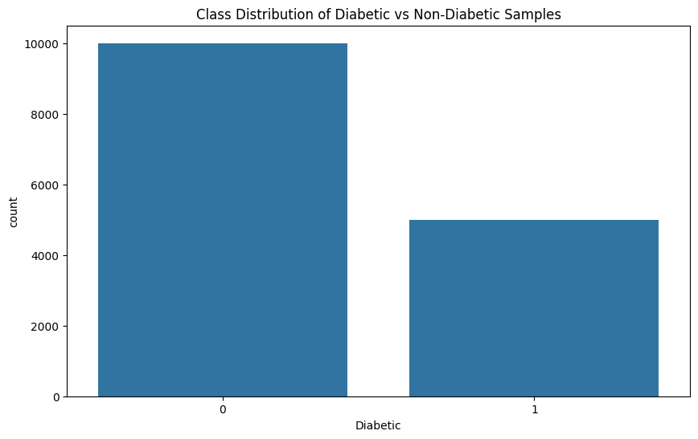
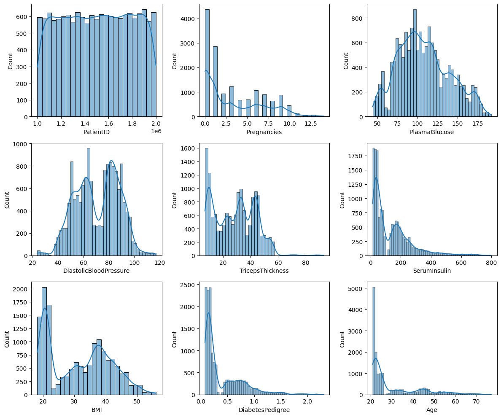

## Exploratory Data Analysis (EDA)

### Introduction to EDA

Exploratory Data Analysis (EDA) is a critical preliminary step in the data science workflow that involves analyzing and visualizing datasets to understand and summarize their main characteristics. Typically, we employ techniques to:

- Extract important features
- Detect outliers, anomalies, missing values
- Analyze feature distributions
- Identify correlations between variables
- Test underlying assumptions

### Diabetes Dataset EDA Notebook Contents

The `eda.ipynb` notebook is a simple example to demonstrate what EDA of the diabetes dataset might look like, including:

1. **Basic Dataset Insights**:
   - A data preview
   - A statistical summary
   - A check for duplicate records

2. **Class Distribution**:
   - Visualization of diabetic vs. non-diabetic sample counts
   
   
   
   *This visualization shows the distribution of diabetic vs. non-diabetic patients in the dataset. It helps identify potential class imbalance, which is critical for understanding model performance metrics and potentially implementing techniques like class weighting or resampling strategies.*

3. **Feature Distributions**:
   - Histograms with kernel density estimation (KDE) for each feature
   
   
   
   *These histograms with kernel density estimation show the distribution of each feature in the dataset. They help identify the shape of distributions (normal, skewed, bimodal), potential outliers, and the range of values, which can inform feature scaling and transformation decisions.*
   
   - Density plots showing feature distributions separated by diabetic status
   
   
   
   *These density plots show how feature distributions differ between diabetic and non-diabetic patients. Areas where the distributions diverge significantly indicate features that may have strong predictive power for diabetes, helping guide feature selection and importance analysis.*

