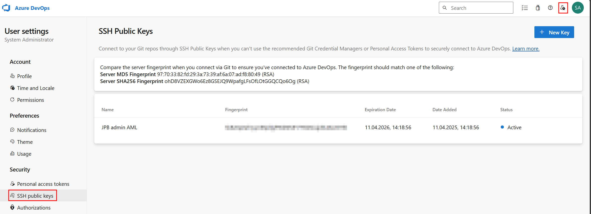

# Git Integration with Azure Machine Learning

Azure Machine Learning fully supports Git repositories for tracking machine learning development work. You can clone repositories directly onto your shared Azure Machine Learning workspace file system from any Git-compatible service, such as GitHub, GitLab, Bitbucket, or Azure DevOps.

Git integration in Azure Machine Learning allows you to:
- Track code changes
- Collaborate with team members
- Maintain version control for ML experiments
- Implement CI/CD pipelines for ML workflows
- Reproduce experiments with specific code versions

> **Tip**: You can use Visual Studio Code to interact with Git through an enhanced graphical user interface, by connecting an AML workspace compute instance to your local workstation VS Code.

## Step-by-Step Guide

### 1. Generate and Save a New SSH Key

To generate a new SSH key for secure Git operations, open a terminal in Azure Machine Learning studio Notebook page and run:

```bash
# Generate a new SSH key with your email address
ssh-keygen -t ed25519 -C "your_email@example.com"
```

### 2. Add the Public Key to Your Git Account

After generating your SSH key, add the public key to your Git account.

```bash
# Display your public key
cat ~/.ssh/id_ed25519.pub
```

For example in the SSH keys section of your Azure DevOps user settings.


### 3. Clone a Git Repository

```bash
# Clone an existing repository
git clone git@ssh.dev.azure.com:v3/<your org>/<your project>/<your repo>

# Navigate to the repository
cd your-repo
```