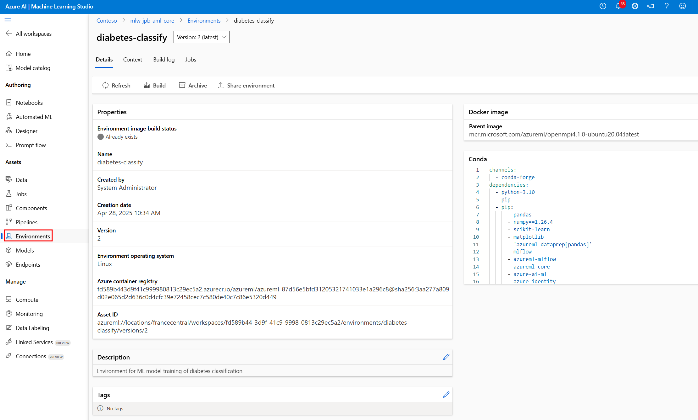

# Azure Machine Learning Environments

Here we explain what an Azure Machine Learning environment is, and how to register a custom environment with an AML workspace using a conda YAML file.

## What is an Azure Machine Learning Environment?

An Azure Machine Learning environment defines a versioned execution environment for machine learning jobs and deployments, and encapsulates the dependencies for your code. Environments ensure reproducibility, consistency, and portability across different compute targets and team members.

## Registering an Environment with the Azure ML Python SDK v2

This directory contains a helper script `register_aml_environment_from_yaml.py` that uses the Azure ML Python SDK v2 to register an environment referencing a conda YAML file.

### The Environment Definition

The `conda.yaml` file in this directory defines the Python dependencies for the diabetes classification use case, for example:

```yaml
name: diabetes-classify-env
channels:
  - conda-forge
dependencies:
  - python=3.10
  - pip
  - pip:
      - pandas
      - numpy==1.26.4
      - scikit-learn
      - matplotlib
      - azureml-dataprep[pandas]
      - mlflow
      - azureml-mlflow
      - azureml-core
      - azure-ai-ml
      - azure-identity
      - azureml-inference-server-http
      - azureml.fsspec
```

This environment includes:
- Python 3.10 as the base interpreter
- Data processing libraries (pandas, numpy)
- Machine learning libraries (scikit-learn)
- Visualization tools (matplotlib)
- Azure ML integration packages (azureml-core, azure-ai-ml, etc.)
- MLflow for experiment tracking

### Using the Helper Script

To register this environment with your Azure ML workspace, run the helper script:

```bash
# Register with default parameters
python register_aml_environment_from_yaml.py
```

The registered environment can be viewed in AML studio:


