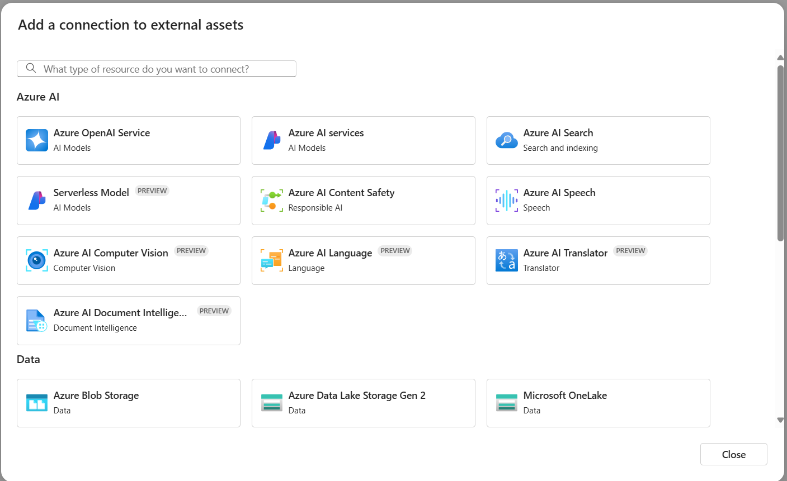

In the Azure Machine Learning workspace, connections can be configured to be shared across the entire workspace or limited to the creator. Secrets associated with connections are securely persisted in the corresponding Azure Key Vault, adhering to robust security and compliance standards.

Connections can include Azure OpenAI, Azure AI Search, and Azure Content Safety, primarily for consumption by promptflow.

## Resources
https://learn.microsoft.com/en-us/azure/machine-learning/prompt-flow/overview-what-is-prompt-flow?view=azureml-api-2
