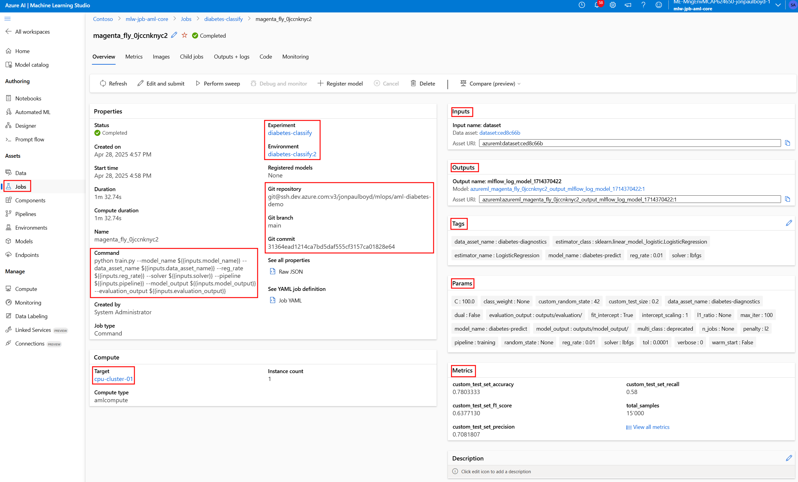
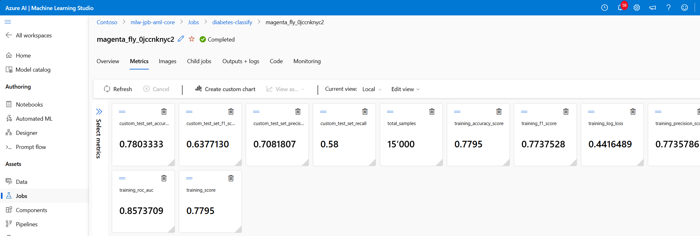
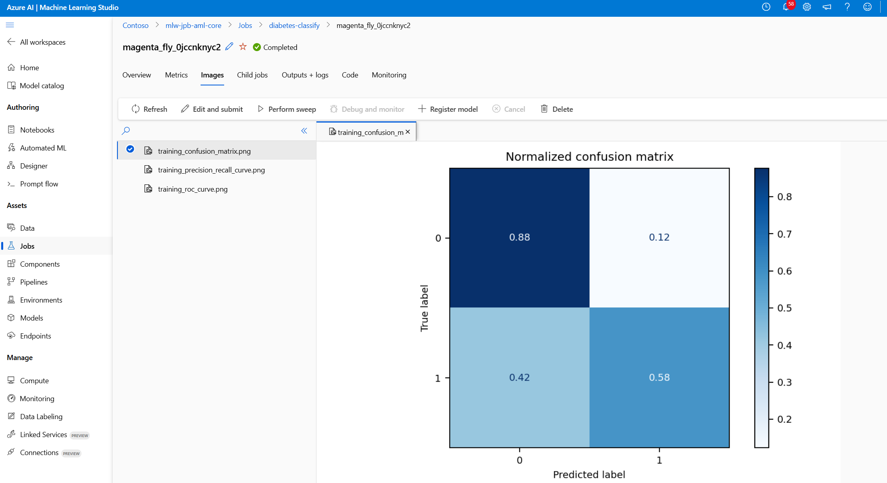
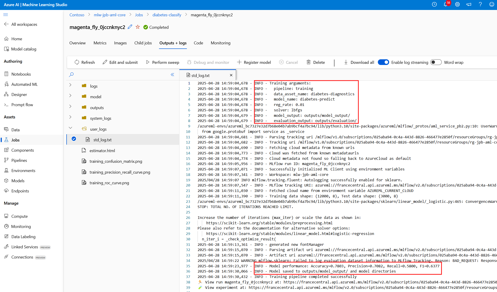
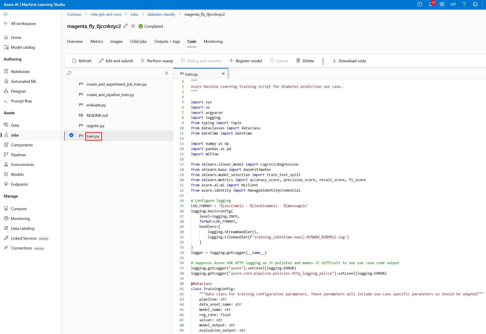
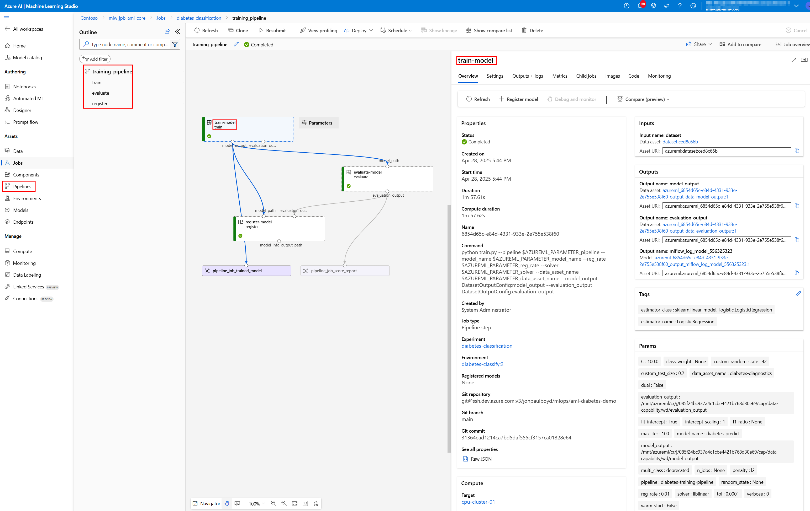

# Training Models with Azure Machine Learning

The following briefly explains two approaches for custom, pro code training of machine learning models for diabetes prediction using AML: the Experiment Job approach and the Pipeline approach.

## AML Jobs

An Azure ML job is the fundamental unit of work in Azure Machine Learning. Jobs represent:

- A **single execution** of a specific machine learning task
- Typically focused on **one discrete operation** like training a model, processing data, or evaluating model performance
- Runs in a specific **compute context** (like a compute cluster)
- Has its own **resource requirements, logs, metrics, and outputs**

## AML Pipelines

An Azure ML pipeline is a workflow that connects multiple jobs together:

- **Orchestrates a sequence** of machine learning tasks
- Enables **workflow automation** from data preparation to model deployment
- Allows for **parallel execution** of independent steps
- Provides **reusability** of workflows across different scenarios
- Supports **incremental runs** (only re-running steps affected by changes)
- Enables **tracking of data lineage** across the workflow

### When to Use Each

- **Use Jobs**: When you need to perform a single, isolated task like experimenting with a model training script
- **Use Pipelines**: When you need to create reproducible, automated workflows with multiple steps that can be scheduled, versioned, and shared

## Benefits of AML Pipelines

AML pipelines split complex machine learning tasks into manageable components that can be developed, optimized, and automated individually. This approach provides two key advantages:

- **Standardized MLOps & Team Collaboration**: Pipelines enable different teams (data engineers, data scientists, ML engineers) to work independently on specific steps while integrating their work into a unified workflow. Each team can focus on their expertise area while the pipeline orchestrates the dependencies between steps. Separate pipeline steps can easily be incorporated into a standardised MLOps CI/CD pipeline.

- **Training Efficiency & Cost Reduction**: Pipelines automatically calculate which steps remain unchanged between runs and reuse previous outputs, avoiding redundant processing. Additionally, different steps can run on different compute targets (e.g., memory-intensive data processing on large memory CPU machines, computation-intensive deep learning model training on GPU machines), optimizing resource usage and reducing costs.


## Environment Setup

Before running the training jobs, you need to set up the following environment variables for MLflow authentication and tracking of the machine learning runs:

```bash
export MANAGED_IDENTITY_CLIENT_ID="<your-managed-identity-client-id>"
export AZUREML_ARM_SUBSCRIPTION="<your-subscription-id>"
export AZUREML_ARM_RESOURCEGROUP="<your-resource-group-name>"
export AZUREML_ARM_WORKSPACE_NAME="<your-workspace-name>"
```

### Experiment Job
See the cli command below for an example of executing standalone diabtes model training as an AML job. 

```bash
python create_aml_experiment_job_train.py \
  --experiment_name "diabetes-classify" \
  --environment_name "diabetes-classify" \
  --model_name "diabetes-model-predict" \
  --compute_name "cpu-cluster-01" \
  --data_asset_name "diabetes-diagnostics" \
  --reg_rate 0.01 \
  --solver "lbfgs"
```

The screenshot below shows the main overview of an Azure Machine Learning job for training our model for diabetes classification. It shows the job's status, execution time, and key metadata such as:
- the experiment name *diabetes-classify*
- the compute target *cpu-cluster-01*
- the environment used, *diabetes-classify:3*
- Git details for the associated job code
- The command executed
- Key parameters and metrics captured by MLflow tracking





The screenshot eblow shows the performance metrics tracked during model training. These include the custom classification metrics for accuracy, precision, recall, and F1 score, in addition to the autologged MLflow metrics.



The screenshot below displays visualizations generated during the model evaluation process. These include the ROC curve plot (the trade-off between true positive rate and false positive rate at various classification thresholds), plus the confusion matrix. All 3 images are autogenerated by MLFlow sklearn integration.



The screenshot below shows the outputs and logs generated during the job execution. It displays the console output from the training script, including information about model training parameters, and evaluation results.



The screenshot below displays the code snapshot taken for the job. Here, we show the Python script used for model training. This gives us traceability and transparency on the exact implementation details of the model training process, allowing for reproducibility and understanding exactly how the model was created.




### Pipeline Approach
See the cli command below for an example of running a pipeline that executes a workflow of training, evaluating, and regestering a diabetes prediction model. 
```bash
python create_aml_pipeline_train.py \
  --pipeline "diabetes-training-pipeline" \
  --experiment_name "diabetes-classification" \
  --environment_name "diabetes-classify" \
  --model_name "diabetes-predict" \
  --reg_rate 0.01 \
  --solver "liblinear" \
  --data_asset_name "diabetes-diagnostics" \
  --compute_name "cpu-cluster-01" \
  --evaluation_output "outputs/evaluation"
```


The screenshot below shows the generated AML pipeline, with a directed graph with three connected nodes representing the pipeline's workflow that includes model training, evaluation, and registration. 

**Train Model Node**: The first node in the pipeline, labeled *train-model*, represents the model training step. This node takes inputs including the data asset name *diabetes-diagnostics*, pipeline name, model name, regularization rate (0.01), and solver algorithm (liblinear). It produces one output, the path to the saved trained model.

**Evaluate Model Node**: The middle node, labeled **evaluate-model**, receives the trained model path from the training step. This node loads the model then evaluates it's performance using metrics like accuracy. It generates evaluation outputs including performance visualizations of performance metrics, metrics comparisons with historical versions of the same model, and a deployment flag indicating whether the model should be promoted as the new champion model and registered in AML, based on its performance compared to previous versions.

**Register Model Node**: The final node, labeled **register-model**, receives both the trained model path from the first node and the evaluation results from the second node. This step checks the deployment flag and, if positive, registers the model in the Azure ML model registry.

**Note** in AML studio you can click on any node to view detailed information about that specific node job, including its inputs, outputs, metrics, code, logs, and execution details.

