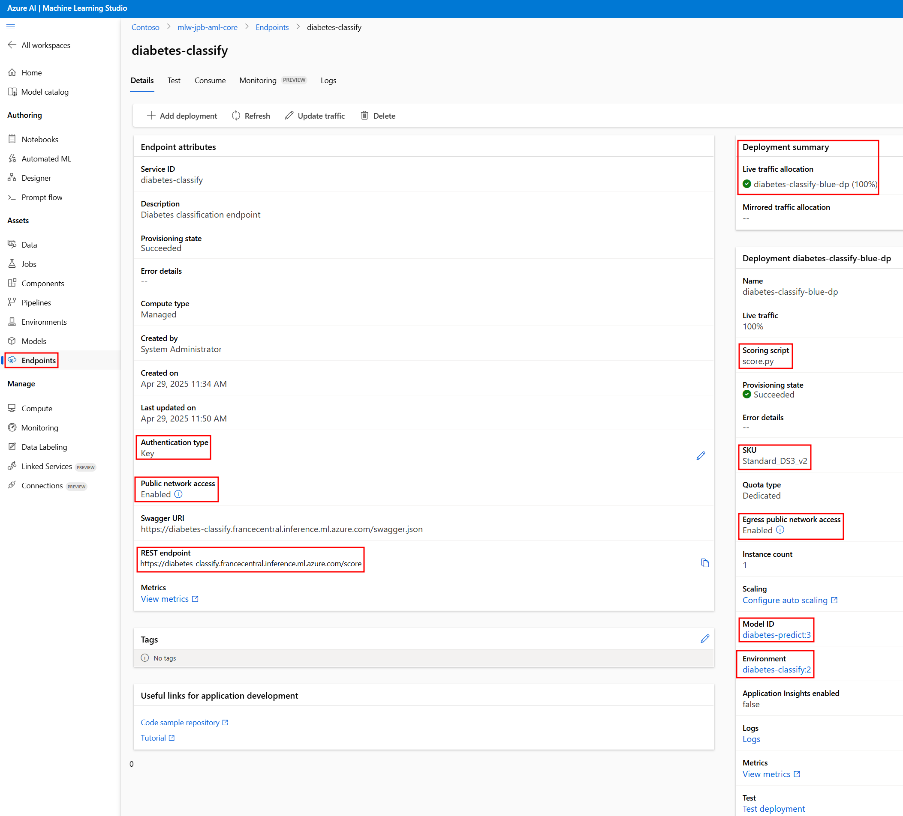

# Deploying Models with Azure Machine Learning

The following explains AML online endpoints and deployments for machine learning model real-time inferencing. Our example demonstrates deploying a diabetes classification model that predicts whether a patient is diabetic based on diagnostic measurements.

## Understanding Online Endpoints and Deployments

### Model Online Managed Endpoints

An online managed endpoint is an HTTPS endpoint that serves as the interface for making a model inference. Key features include:

- **Authentication**: Supports key-based or token-based authentication
- **Traffic Management**: Controls traffic distribution across multiple deployments
- **Monitoring**: Enables tracking of availability, performance, and SLA metrics
- **Network Isolation**: Can be secured using private endpoints and virtual networks

### Model Deployments

A deployment is the implementation that hosts your model and executes the inference (otherwise known as scoring) code. Key characteristics include:

- **Model Hosting**: Contains the actual model files, scoring script, and environment
- **Compute Resources**: Specifies the VM type and instance count for scaling
- **Independent Lifecycle**: Can be updated or replaced without changing the endpoint

### Relationship Between Endpoints and Deployments

- An endpoint can have multiple deployments (e.g., blue/green deployment strategy)
- The endpoint routes traffic to deployments based on configured traffic allocation
- Deployments can be added, updated, or removed without changing the endpoint's URI
- This separation enables seamless model updates with zero downtime

## Creating an Online Endpoint

The following command creates a managed online endpoint for the diabetes classification model:

```bash
python create_online_endpoint.py \
  --endpoint_name diabetes-classify \
  --description "Diabetes classification endpoint" \
  --auth_mode aml_token \
  --public_network enabled \
  --verbose
```

### Key Parameters:

- **endpoint_name**: Unique name for the endpoint
- **description**: Human-readable description of the endpoint's purpose
- **auth_mode**: Authentication method (key or AML token)
- **public_network**: Whether the endpoint is accessible over the public internet

## Creating a Deployment

After creating an endpoint, you can deploy your model with the following command:

```bash
python create_online_deployment.py \
  --deployment_name diabetes-classify-blue-dp \
  --endpoint_name diabetes-classify \
  --model_path azureml:diabetes-predict:3 \
  --environment diabetes-classify \
  --score_path 09-deploy-model \
  --score_script score.py \
  --instance_type Standard_DS3_v2 \
  --instance_count 1 \
  --traffic_allocation 100
```

### Key Parameters:

- **deployment_name**: Unique name for the deployment
- **endpoint_name**: Name of the endpoint to deploy to
- **model_path**: Reference to the registered model
- **environment**: ML environment with required dependencies
- **score_path**: Directory containing the scoring script
- **score_script**: Python script that handles inference requests
- **instance_type**: VM size for compute resources
- **instance_count**: Number of instances for scaling
- **traffic_allocation**: Percentage of traffic to route to this deployment



## Inference Process

When a request is sent to the endpoint:

1. The endpoint authenticates the request
2. Traffic is routed to the appropriate deployment based on traffic allocation
3. The deployment loads the model and executes the scoring script
4. The scoring script processes the input data, invokes the model prediction with the input, and returns a prediction

## Monitoring and Management

Azure Machine Learning provides several capabilities for monitoring and managing your deployments:

- **Metrics**: Track request counts, latency, and resource utilization
- **Logs**: Access application logs for debugging and auditing
- **Autoscaling**: Automatically adjust instance count based on load

## Security Considerations

- Recommended to use private endpoints for secure communication
- Implement network isolation for sensitive workloads
- Rotate authentication keys regularly
