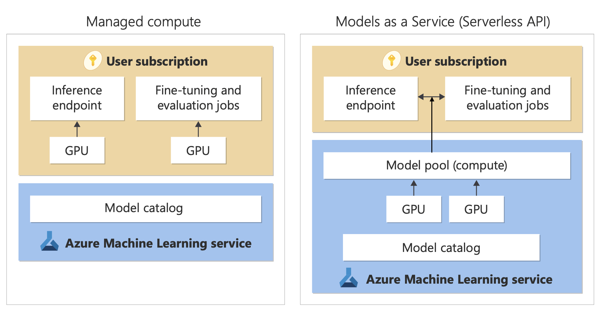

# Azure Machine Learning Model Catalog

The model catalog in Azure Machine Learning studio is a hub for discovering and using a wide range of models to build Generative AI applications, featuring hundreds of models from providers including Azure OpenAI, Mistral, Meta, Cohere, NVIDIA, and Hugging Face.

## Overview

Models in the catalog are organized by Collections, with three primary types:

### 1. Models Curated by Azure AI

- The most popular third-party open weight and proprietary models, packaged and optimized to work seamlessly on the Azure AI platform
- Subject to the model provider's license terms

### 2. Azure OpenAI Models

- Flagship Azure OpenAI models available exclusively on Azure, accessible through the *Azure OpenAI* collection via integration with the Azure OpenAI Service
- Supported by Microsoft
- Subject to the product terms and SLA for Azure OpenAI Service

### 3. Open Models from the Hugging Face Hub

- Hundreds of models accessible via the *HuggingFace* collection, available for real-time inference with online endpoints
- Created, maintained, and supported by HuggingFace

## Key Capabilities

- **Discover** - review model cards, try sample inference, and browse code samples to evaluate, fine-tune, or deploy the model.
- **Compare** - benchmarks across models
- **Fine-tune** - Customize fine-tunable models using your own training data and pick the best model by comparing metrics across all your fine-tuning jobs.
- **Deploy** - Deploy pretrained models or fine-tuned models seamlessly for inference. Models that can be deployed to managed compute can also be downloaded.

## Deployment Options

The Model Catalog offers two distinct ways to deploy models: **managed compute** and **serverless api**

- **Managed compute** - Model weights are deployed to dedicated Virtual Machines with managed online endpoints. The managed online endpoint, which can have one or more deployments, makes available a REST API for inference. You're billed for the Virtual Machine core hours used by the deployments.

- **Serverless API** - Access to models is through a deployment that provisions an API to access the model. The API provides access to the model hosted in a central GPU pool, managed by Microsoft, for inference. This mode of access is referred to as "Models as a Service". You're billed for inputs and outputs to the APIs, typically in tokens; pricing information is provided before you deploy.

## Resources

[AML model catelog and collections](https://learn.microsoft.com/en-us/azure/machine-learning/concept-model-catalog?view=azureml-api-2)
