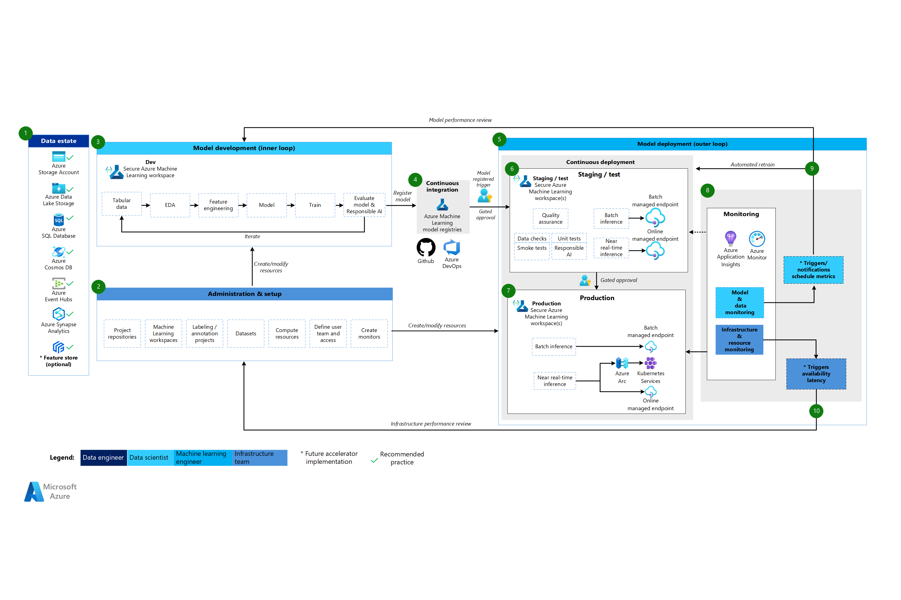

# MLOps: Machine Learning Operations

## Considerations
This repository demonstrated a simple implementation of a diabetes prediction classifier model using Azure Machine Learning (AML). By developing each ML task in a well-structured code repository to manage environment registration, model training, evaluation, and deployment as modular components, we created a foundation that can be easily mapped and reused in a comprehensive MLOps workflow to automate the steps needed to prepare, validate, and execute getting this model into production.

## Standardized Pipeline Templates

Machine learning tasks like model training will of course vary across use cases, for example in feature preparation and the algorithms used. Other tasks like registering an environment or model will the same. THis means there is opportunity to standardise several steps of the MLOps pipeline, offering several key advantages:

1. **Consistency**: Ensures uniform implementation of ML workflows across projects and teams
2. **Efficiency**: Reduces development time by providing ready-to-use templates for common tasks
3. **Maintainability**: Centralizes pipeline logic, making updates and improvements easier to manage
4. **Governance**: Facilitates compliance with organizational standards and regulatory requirements, for example no public access to endpoints.

## Automated Change Detection in Repositories

By baking repository change detection into MLOps piplelines, we can selectively execute only the necessart pipeline stages, based on which files have changed in the use case repository. For example, if we only change deployment traffic parameters, we can skip model training.

